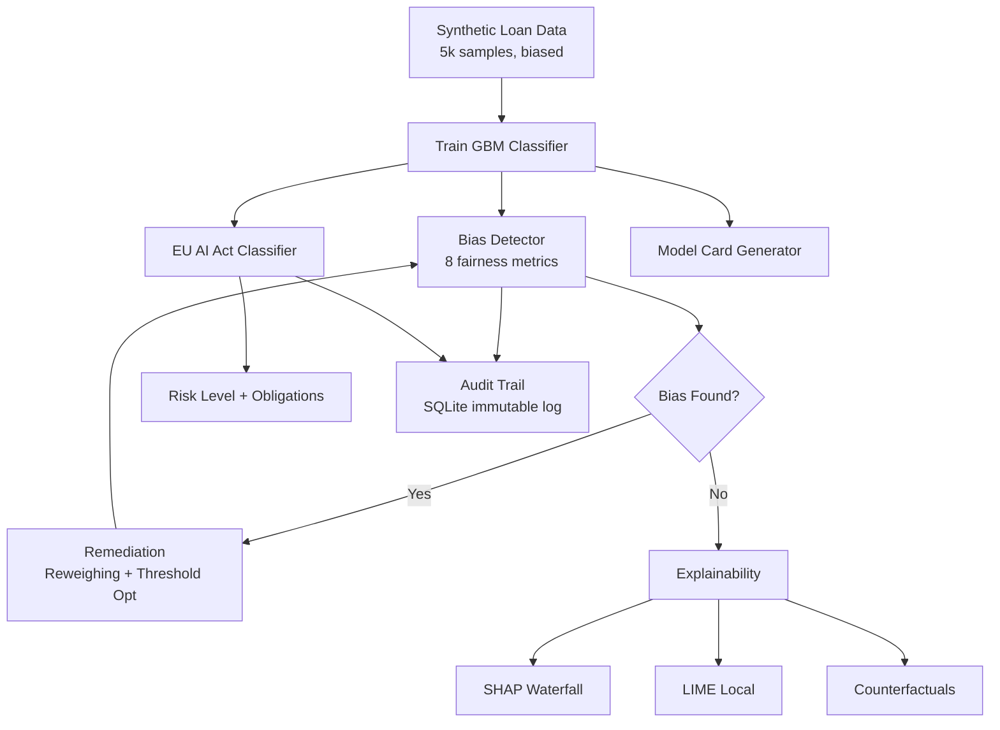

# ⚖️ AI Ethics & Governance Dashboard

[](https://github.com/yourusername/ai-ethics-governance/actions)
[](https://www.python.org/)
[](LICENSE)

> Responsible AI platform with EU AI Act compliance, 8 fairness metrics, SHAP/LIME explainability, counterfactual explanations, and immutable audit trail.

## Problem

ML models in production often exhibit bias, lack transparency, and don't comply with regulations like the EU AI Act. Teams need a unified workflow to detect bias, explain decisions, check compliance, and maintain audit trails.

## Case Study

**Loan Approval Model** → detect race/gender bias → apply reweighing → show improvement across all metrics → EU AI Act: High Risk → 15-obligation checklist → auto-generated model card.

## Architecture



## Fairness Metrics (8)

| Metric | Ideal | Flag |
|--------|-------|------|
| Demographic Parity Diff | 0 | > 0.1 |
| Disparate Impact | 1.0 | < 0.8 (4/5 rule) |
| Equalized Odds Diff | 0 | > 0.1 |
| Equal Opportunity Diff | 0 | > 0.1 |
| Predictive Parity Diff | 0 | > 0.1 |
| Treatment Equality | 0 | > 0.2 |
| Calibration Diff | 0 | > 0.1 |
| Individual Fairness | 1.0 | < 0.9 |

## Quickstart

```bash
git clone https://github.com/yourusername/ai-ethics-governance.git
cd ai-ethics-governance
pip install -r requirements.txt
pytest tests/ --cov=app -v
streamlit run app/main.py
```

## Docker

```bash
cd docker && docker-compose up --build
```

## Tech Stack

| Component | Technology |
|-----------|-----------|
| Bias Detection | Custom (8 metrics) |
| Explainability | SHAP, LIME, Counterfactuals |
| Compliance | EU AI Act classifier |
| Audit | SQLite immutable trail |
| Viz | Plotly |
| Dashboard | Streamlit |
